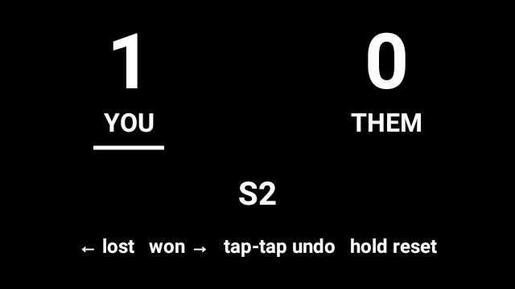
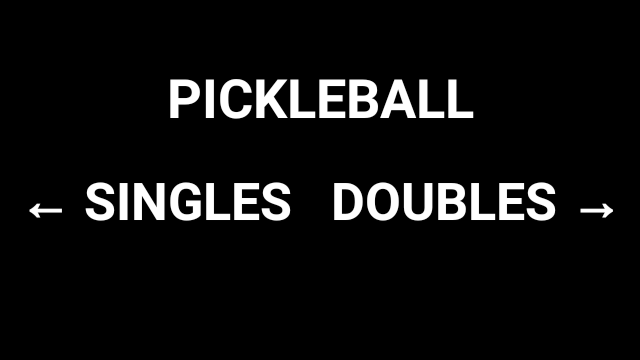
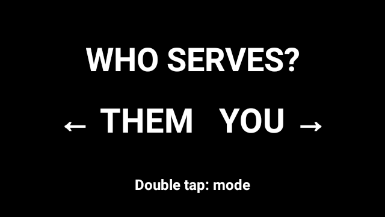
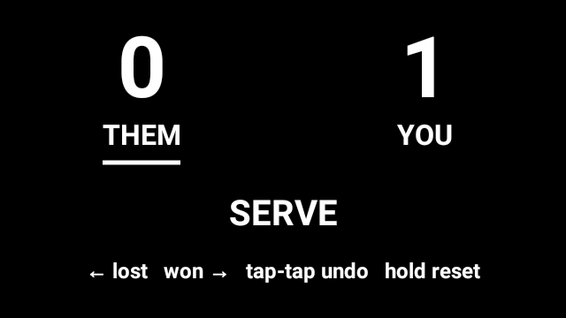
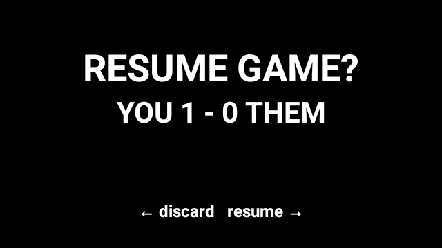
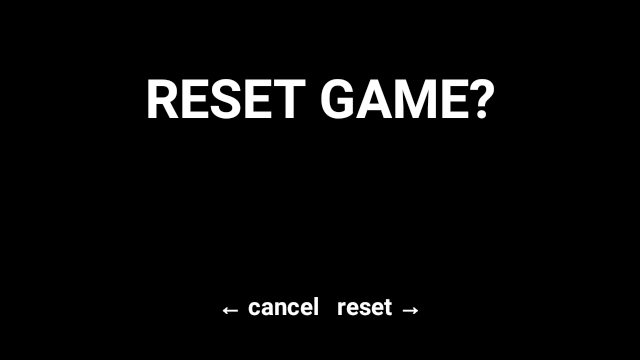
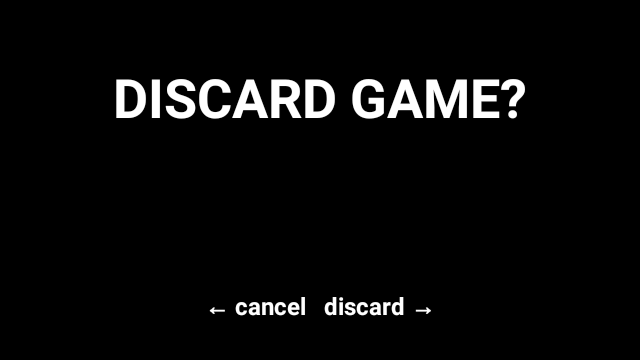
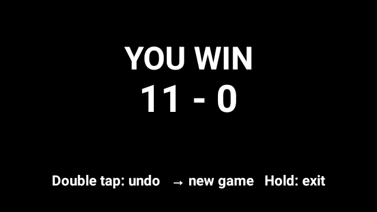
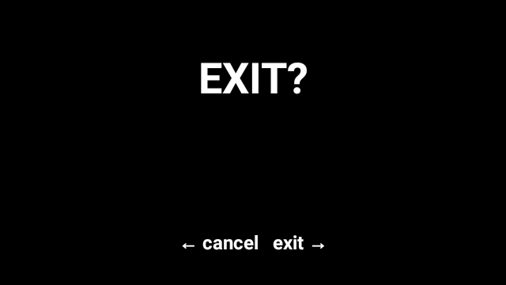
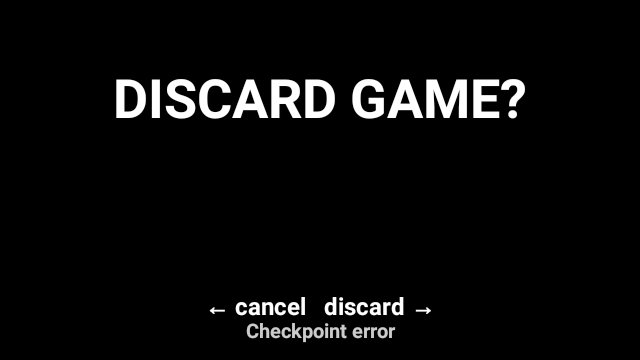

# Glass Pickleball Scoreboard

[](https://github.com/sandmhan/glass-pb-scoreboard/releases/latest)
[](https://github.com/sandmhan/glass-pb-scoreboard/actions/workflows/ci.yml)
[](LICENSE)
[](docs/device-validation.md)

An offline, glanceable, touchpad-only pickleball scorekeeper for **Google Glass Explorer Edition running AOSP 5.1**. It tracks complete singles and doubles games without a phone, network connection, voice input, or proprietary Glass SDK.

<p align="center">
  
</p>

## Download

Download the current installable APK from the latest GitHub release:

**[Download Glass Pickleball Scoreboard APK](https://github.com/sandmhan/glass-pb-scoreboard/releases/latest/download/glass-pb-scoreboard.apk)**

The APK is intended for Google Glass XE devices running AOSP Android 5.1/API 22. It is signed with the project's dedicated release key so future versions can be installed as updates.

Release signer SHA-256 certificate fingerprint:

```text
7d84a993db77ef47bbee7241808f15901a4d482a230ac4c71d99c2cf519c48df
```

The public certificate is available at [`docs/release-signing-certificate.pem`](docs/release-signing-certificate.pem).

## Features

- Singles and doubles modes selected before every new game
- Either side can serve first
- Correct doubles opening-server exception and S1/S2 side-out behavior
- Singles service transfers without a server number
- First to 11, win by 2, including deuce games
- Serving side always shown on the left
- Multi-action undo history
- Reset and exit confirmations that prevent accidental data loss
- Automatic offline persistence after every accepted scoring action
- Resume after app termination, Glass reboot, or battery loss
- Safe recovery instead of a crash when stored state is damaged
- High-contrast, full-screen 640×360 interface
- No ads, analytics, accounts, network services, or `INTERNET` permission

## Controls

| Touchpad gesture | During a game | In prompts |
| --- | --- | --- |
| Swipe forward | Serving side won the rally; add one point | Choose the right/affirmative option |
| Swipe backward | Serving side lost the rally; advance or transfer serve | Choose the left/cancel option |
| Double tap | Undo the previous scoring action | Return from serve selection; otherwise ignored |
| Long press | Open reset confirmation | Open exit confirmation where available |
| Single tap | Ignored | Ignored |

The serving side is always on the **left**. In doubles, `S1` and `S2` identify the current server. The opening side starts at `S2`, matching pickleball's one-server opening exception.

## UI flow and screenshots

All screenshots below were captured directly from a Glass 1 at 640×360.

<table>
  <tr>
    <td width="50%"><br><strong>1. Mode selection</strong></td>
    <td width="50%"><br><strong>2. Initial server</strong></td>
  </tr>
  <tr>
    <td><br><strong>3. Doubles game</strong></td>
    <td><br><strong>4. Singles game</strong></td>
  </tr>
  <tr>
    <td><br><strong>5. Resume after interruption</strong></td>
    <td><br><strong>6. Reset confirmation</strong></td>
  </tr>
  <tr>
    <td><br><strong>7. Discard confirmation</strong></td>
    <td><br><strong>8. Game over</strong></td>
  </tr>
  <tr>
    <td><br><strong>9. Exit confirmation</strong></td>
    <td><br><strong>10. Safe checkpoint recovery</strong></td>
  </tr>
</table>

## Install on Glass

### Requirements

- Google Glass Explorer Edition with AOSP Android 5.1/API 22
- USB debugging enabled
- Android Platform Tools (`adb`) on the host computer

### Install

```bash
adb devices
adb install -r glass-pb-scoreboard.apk
adb shell am start -n com.glasspb.scoreboard/.MainActivity
```

For an existing installation, `adb install -r` retains an active game as long as the APK is signed by the same release key.

## Build from source

### Prerequisites

- JDK 17
- Android SDK Platform 34
- Android SDK Build Tools 34.0.0 or newer
- Git

The project uses its checked-in Gradle 8.9 wrapper and downloads Android Gradle Plugin 8.7.3 automatically.

```bash
git clone https://github.com/sandmhan/glass-pb-scoreboard.git
cd glass-pb-scoreboard

# Point Gradle at your Android SDK if ANDROID_HOME is not already set.
printf 'sdk.dir=%s\n' "$ANDROID_HOME" > local.properties

./gradlew testDebugUnitTest
./gradlew lintDebug
./gradlew assembleDebug
```

Debug APK:

```text
app/build/outputs/apk/debug/app-debug.apk
```

### Build a signed release

Release credentials are supplied only through environment variables and must never be committed:

```bash
export ANDROID_KEYSTORE_PATH=/absolute/path/to/release.keystore
export ANDROID_KEYSTORE_PASSWORD='...'
export ANDROID_KEY_ALIAS='...'
export ANDROID_KEY_PASSWORD='...'

./gradlew testDebugUnitTest lintRelease assembleRelease
```

Signed APK:

```text
app/build/outputs/apk/release/app-release.apk
```

Without all four signing variables, Gradle intentionally produces an unsigned release APK.

## Testing

The JVM suite covers the pure match engine, UI navigation reducer, persistence codec, persistence failure atomicity, and raw gesture recognizer:

```bash
./gradlew testDebugUnitTest lintDebug lintRelease assembleDebug assembleRelease
```

Version 1.0.0 has **67 passing tests** and no lint findings. Physical validation on Glass includes full singles and doubles games, deuce, undo, reset safety, process recovery, reboot recovery, offline operation, malformed-state recovery, and raw touch input. See [the device validation record](docs/device-validation.md).

## Architecture

```text
Glass touchpad
    ↓
RawGestureRecognizer        input classification only
    ↓
ScoreboardController        screen flow + commit-before-publish coordination
    ↓
MatchEngine / MatchState    pure pickleball state transitions
    ↓
CheckpointStore             private, versioned SharedPreferences persistence
    ↓
ScoreboardView              high-contrast Canvas rendering
```

The domain engine has no Android dependencies, so scoring behavior is deterministic and unit-testable. Canonical `YOU` and `THEM` identities never depend on display order; rendering derives the left and right sides from service possession.

## Privacy and permissions

The app stores one active-game checkpoint in private local application storage. It does not request network access and contains no telemetry, advertising, account, location, camera, or microphone integration.

## Contributing

Bug reports and pull requests are welcome. Please include tests for scoring or persistence behavior changes and run the full test/lint command before opening a pull request.

## License

Released under the [MIT License](LICENSE).
